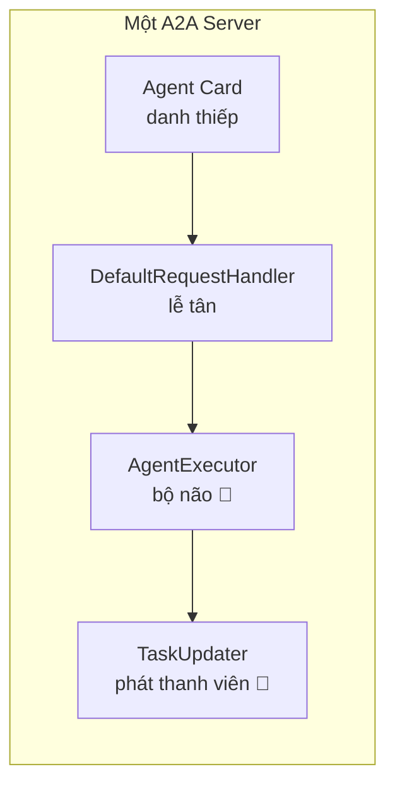
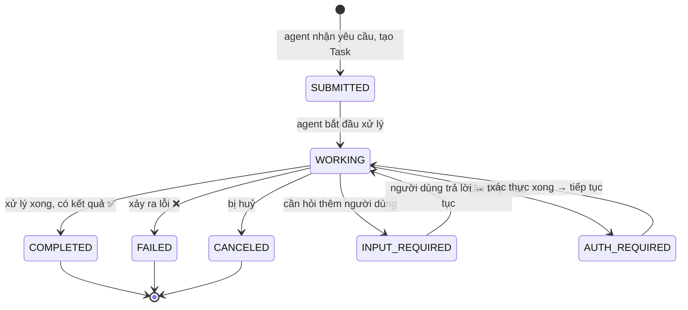

# 🧠 `AgentExecutor` + vòng đời của `Task` (submitted → working → completed)

> File này giải thích **`AgentExecutor` là gì** và **`Task` sống qua những trạng thái nào** trong A2A.
> Mục tiêu: **học sinh cấp 3 cũng hiểu** — ví von nhà hàng 🍜, có sơ đồ, có code thật.
> Đối chiếu với notebook và code trong `my_a2a_system/weather_agent.py`.

---

## 1. `AgentExecutor` là gì?

**`AgentExecutor` = "Bộ não xử lý" — nơi duy nhất bạn viết logic của agent.**

Trong kiến trúc A2A Server (xem lại file `agent-card-configs.md`), các mảnh ghép là:



- **DefaultRequestHandler** ("lễ tân") nhận yêu cầu từ mạng, quản lý Task, rồi gọi `AgentExecutor`.
- **AgentExecutor** ("bộ não") — **bạn viết code ở đây**: đọc câu hỏi, suy nghĩ, trả lời.
- **TaskUpdater** ("phát thanh viên") — báo trạng thái & kết quả cho client (giải thích ở file `task-updater.md`).

> 🎬 **Ví von:** Server là một **nhà hàng**. `DefaultRequestHandler` là **lễ tân** nhận đơn. `AgentExecutor` là **đầu bếp** — người thực sự nấu món. `TaskUpdater` là **người bưng bê** — mang từng trạng thái món ăn ra báo cho khách.

---

## 2. Giao diện (interface) của `AgentExecutor`

Trong SDK Python, `AgentExecutor` là một **lớp trừu tượng** (abstract class). Bạn **kế thừa** nó và bắt buộc viết **2 hàm**:

```python
from a2a.server.agent_execution.agent_executor import AgentExecutor

class WeatherExecutor(AgentExecutor):

    async def execute(self, context, event_queue):
        """Gọi khi có yêu cầu mới. Bạn làm việc ở đây."""
        ...

    async def cancel(self, context, event_queue):
        """Gọi khi client muốn HUỶ task đang chạy."""
        ...
```

| Hàm | Khi nào framework gọi | Bạn phải làm gì |
|---|---|---|
| `execute()` | Có **message mới** từ client | Đọc câu hỏi → suy nghĩ → phát kết quả |
| `cancel()` | Client **yêu cầu huỷ** task | Dừng việc → báo trạng thái `canceled` |

### Tham số `context` — "hồ sơ vụ việc"

`context` (kiểu `RequestContext`) là **toàn bộ thông tin của yêu cầu hiện tại**. Các thứ hay dùng:

| Thuộc tính | Dùng để làm gì |
|---|---|
| `context.get_user_input()` | Lấy **câu hỏi dạng text** của người dùng (hay dùng nhất) |
| `context.task_id` | Số hiệu **phiếu công việc** của task này |
| `context.context_id` | Số hiệu **phiên hội thoại** (nhiều task thuộc cùng 1 cuộc trò chuyện) |
| `context.message` | Toàn bộ message gốc (có thể chứa file/ảnh...) |

### Tham số `event_queue` — "đường ống phát thanh"

`event_queue` là nơi bạn **bơm các sự kiện** (trạng thái, kết quả) ra. Nhưng bạn **không bơm trực tiếp** — bạn dùng `TaskUpdater` cho tiện (file tiếp theo).

---

## 3. Vòng đời của một `Task`

**`Task` = "Phiếu công việc"** có số hiệu và có vòng đời. Khi agent nhận yêu cầu và tạo một Task, task đó đi qua các trạng thái (`TaskState`):



### Bảng trạng thái (dịch sang tiếng "nhà hàng" 🍜)

| Trạng thái (`TaskState`) | Nghĩa | Ví von nhà hàng | Loại |
|---|---|---|---|
| `SUBMITTED` | Đã nhận & xác nhận phiếu | "Đã nhận đơn #0012" | Trung gian |
| `WORKING` | Đang xử lý | "Đang nấu..." | Trung gian |
| `COMPLETED` | Xong, có kết quả | "Món đã bưng ra bàn" | **Terminal** ✅ |
| `FAILED` | Lỗi | "Nấu hỏng, xin lỗi" | **Terminal** ❌ |
| `CANCELED` | Bị huỷ giữa chừng | "Khách huỷ đơn" | **Terminal** |
| `REJECTED` | Từ chối làm | "Quán từ chối món này" | **Terminal** |
| `INPUT_REQUIRED` | Cần hỏi thêm | "Phở hay bún?" | **Interrupted** ⏸️ |
| `AUTH_REQUIRED` | Cần xác thực | "Cho xem thẻ thành viên" | **Interrupted** ⏸️ |

### 🔑 2 quy tắc vàng của vòng đời

1. **Trạng thái Terminal = "cửa một chiều".** Khi task đã `completed`/`failed`/`canceled`/`rejected` thì **không bao giờ quay lại được** — không thể "tái sinh" task cũ. Muốn làm tiếp → tạo **task mới** trong cùng `contextId`. (Đây gọi là **Task Immutability**.)
2. **Interrupted = "tạm dừng để hỏi".** `input-required` / `auth-required` **chưa phải kết thúc** — agent dừng lại, chờ người dùng trả lời, rồi **tiếp tục** chạy `execute()`.

> 💡 **Vì sao lại thiết kế "cửa một chiều"?** Để mỗi task là một **đơn vị công việc sạch**: input → output rõ ràng, dễ theo dõi, dễ ghi log, dễ trace. Giống như mỗi hóa đơn chỉ ứng với một lần thanh toán.

---

## 4. Đi sâu vào `execute()` — nhìn code thật

Đây là `WeatherExecutor` trong `my_a2a_system/weather_agent.py`. Hãy đối chiếu từng bước với vòng đời:

```python
class WeatherExecutor(AgentExecutor):

    def __init__(self, agent):
        self.agent = agent          # DeepAgent thật (hoặc None nếu mock)

    async def execute(self, context, event_queue):
        # 1) Đọc câu hỏi người dùng
        user_input = context.get_user_input()
        task_id = context.task_id
        context_id = context.context_id

        # 2) "Phát thanh viên" báo trạng thái: WORKING
        updater = TaskUpdater(event_queue, task_id, context_id)
        await updater.start_work(
            message=updater.new_agent_message(
                parts=[Part(text="Đang kiểm tra thời tiết...")]
            )
        )

        # 3) Suy nghĩ: chạy DeepAgent (nếu có) hoặc mock brain
        if self.agent is not None:
            answer = await run_deep_agent(self.agent, user_input, thread_id=task_id)
        else:
            answer = self.mock_brain(user_input)

        # 4) Giao kết quả (artifact) và báo COMPLETED
        await updater.add_artifact(
            parts=[Part(text=answer)], name="response", last_chunk=True
        )
        await updater.complete()
```

**Đối chiếu với vòng đời:**

| Bước | Code | Trạng thái phát ra |
|---|---|---|
| Nhận yêu cầu | Framework tự tạo Task | `SUBMITTED` (framework lo) |
| Bắt đầu xử lý | `updater.start_work(...)` | `WORKING` |
| Suy nghĩ | `run_deep_agent()` / `mock_brain()` | (đang làm) |
| Giao kết quả | `updater.add_artifact(...)` | gửi artifact |
| Kết thúc | `updater.complete()` | `COMPLETED` |

> 📌 **Chú ý:** Bạn không cần tự phát `SUBMITTED` — framework làm điều đó khi nó nhận yêu cầu và tạo Task. Bạn chỉ cần báo `WORKING` rồi đi tới trạng thái cuối.

---

## 5. Framework "lo hộ" những gì? (theo docstring của SDK)

Khi bạn viết `execute()`, SDK đảm bảo một số điều để bạn yên tâm:

| Điều framework đảm bảo | Giải thích dễ hiểu |
|---|---|
| **Mỗi request chạy 1 lần** | `execute()` không bao giờ bị gọi song song cho cùng một request — không lo "đụng hàng" |
| **Lỗi → `failed`** | Nếu `execute()` ném lỗi, framework tự đánh dấu task thành `failed` (bạn không cần tự xử lý) |
| **Sau khi `execute()` kết thúc** | Bạn **không được đụng** vào `context`/`event_queue` nữa — "cúp máy là hết nhiệm vụ" |
| **Nên tự báo trạng thái cuối** | Trước khi trả về, bạn NÊN phát 1 sự kiện terminal (`completed`) hoặc interrupted (`input-required`/`auth-required`) |
| **Huỷ** | Khi client huỷ, `asyncio.CancelledError` được ném vào task đang chạy, và `cancel()` được gọi |

---

## 6. `cancel()` — huỷ task

```python
    async def cancel(self, context, event_queue):
        updater = TaskUpdater(event_queue, context.task_id, context.context_id)
        await updater.cancel()   # phát trạng thái CANCELED
```

- Khi client gọi `CancelTask`, framework gọi `cancel()` của bạn.
- Bạn nên: dừng công việc đang làm (nếu có), rồi phát `canceled` qua `TaskUpdater`.
- Trong ví dụ đơn giản, `cancel()` chỉ cần phát `canceled` là đủ.

---

## 7. Tóm tắt nhanh

| Khái niệm | Ví von | Bạn cần nhớ |
|---|---|---|
| `AgentExecutor` | Đầu bếp | Kế thừa + viết `execute()` và `cancel()` |
| `context` | Hồ sơ vụ việc | `context.get_user_input()` để lấy câu hỏi |
| `Task` | Phiếu công việc | Có vòng đời rõ ràng |
| Terminal states | Điểm đến cuối cùng | `completed`, `failed`, `canceled`, `rejected` — **không quay lại** |
| Interrupted states | Tạm dừng hỏi | `input-required`, `auth-required` — **chờ rồi tiếp tục** |
| TaskUpdater | Người bưng bê | Dùng để phát trạng thái & kết quả (xem file tiếp theo) |

---

## 8. Tham khảo trong repo

- Định nghĩa giao diện + docstring đầy đủ: `refs/a2a-python/src/a2a/server/agent_execution/agent_executor.py`
- Kiến trúc chạy task (producer/consumer): `refs/a2a-python/src/a2a/server/agent_execution/active_task.py`
- Vòng đời Task & ví dụ JSON: `refs/A2A/docs/topics/life-of-a-task.md`
- Định nghĩa `TaskState` gốc: `refs/A2A/specification/a2a.proto` (dòng ~187)
- Code thật: `my_a2a_system/weather_agent.py` (bộ não đơn giản nhất)
