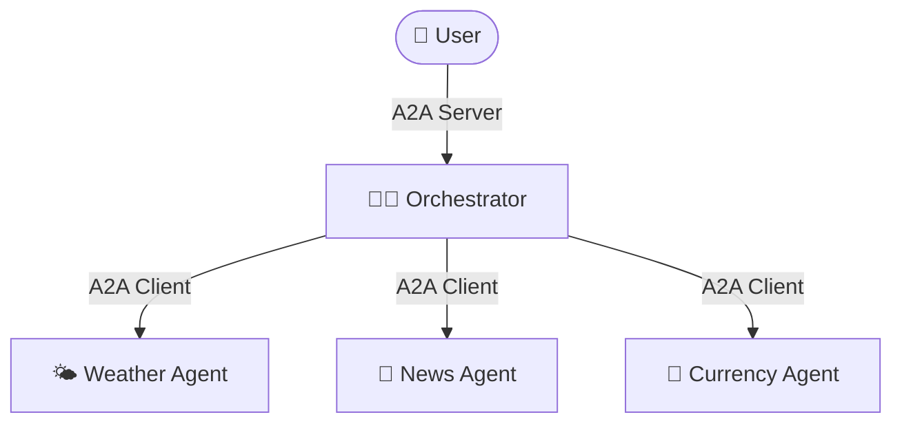
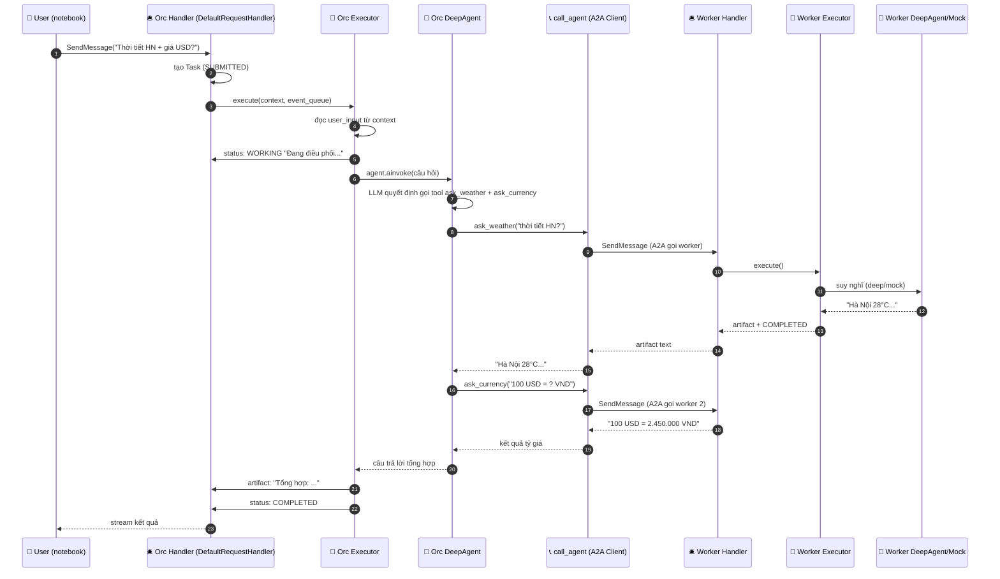

# 🧑‍💼 Toàn bộ flow của Orchestrator (vừa là Server, vừa là Client)

> File này dẫn bạn đi **từng bước một** từ lúc người dùng gõ câu hỏi cho tới khi nhận câu trả lời tổng hợp — qua toàn bộ hệ thống A2A.
> Mục tiêu: **học sinh cấp 3 cũng hiểu**. Có sơ đồ, có bảng, có code thật trong `my_a2a_system/orchestrator_agent.py`.

---

## 1. Vai trò kép của Orchestrator 🎭

Orchestrator là **diễn viên đóng 2 vai** cùng lúc:

| Hướng nói chuyện | Vai trò | Cụ thể |
|---|---|---|
| **Nói với người dùng** (phía trên) | 🛎️ **A2A Server** | Nhận yêu cầu, phát trạng thái, trả kết quả qua `AgentExecutor` |
| **Nói với các worker** (phía dưới) | 📞 **A2A Client** | Gọi Weather/News/Currency qua `call_agent()` |



> 🎬 **Ví von:** Orchestrator là **tổng đài viên** của một trung tâm: nghe khách gọi đến (vai Server), rồi **gọi đi** cho các chuyên viên phụ trách (vai Client), gom câu trả lời rồi báo lại khách.

---

## 2. Sơ đồ toàn cảnh (đầy đủ nhất)



> 🎯 **Đọc theo chiều mũi tên:** đi **xuống** (từ User vào Orchestrator), rồi **xuống nữa** (Orchestrator gọi worker), rồi **ngược lên** (kết quả chảy ngược về User). Giống một "đường hầm 2 tầng": tầng trên là orchestrator, tầng dưới là worker.

---

## 3. Đi từng bước (kèm code thật)

### Bước 1 — Người dùng gọi Orchestrator (vai Server)

Trong notebook, bạn chạy cell:

```python
ket_qua = await call_agent("http://127.0.0.1:41241",
                           "Hôm nay thời tiết Hà Nội thế nào? Và 100 USD đổi được bao nhiêu VND?")
```

`call_agent` đọc Agent Card của orchestrator → tạo client → gửi `SendMessage` tới `http://127.0.0.1:41241/a2a/jsonrpc`. **Lúc này orchestrator là Server** đang nhận yêu cầu.

### Bước 2 — Lễ tân tạo Task & gọi bộ não

`DefaultRequestHandler` (lễ tân) tạo một `Task` (trạng thái `SUBMITTED`) rồi gọi:

```python
# orchestrator_agent.py
async def execute(self, context, event_queue):
    user_input = context.get_user_input()      # lấy câu hỏi
    task_id = context.task_id
    context_id = context.context_id

    updater = TaskUpdater(event_queue, task_id, context_id)
    await updater.start_work(
        message=updater.new_agent_message(
            parts=[Part(text="Đang điều phối các chuyên gia...")]
        )
    )                                          # báo WORKING

    if self.agent is not None:
        answer = await run_deep_agent(self.agent, user_input, thread_id=task_id)  # 🧠 suy nghĩ
    else:
        answer = await self.mock_orchestrate(user_input)                            # 🪄 mock

    await updater.add_artifact(parts=[Part(text=answer)], name="response", last_chunk=True)
    await updater.complete()                   # báo COMPLETED
```

### Bước 3 — "Suy nghĩ" = DeepAgent gọi tools (vai Client)

Bộ não của orchestrator là một **DeepAgent** với 3 "đường dây điện thoại" (tools):

```python
@tool
async def ask_weather(query: str) -> str:
    """Gửi câu hỏi về thời tiết cho Weather Agent."""
    return await call_agent(WEATHER_URL, query, verbose=False)   # 📞 gọi worker

@tool
async def ask_news(query: str) -> str:
    return await call_agent(NEWS_URL, query, verbose=False)

@tool
async def ask_currency(query: str) -> str:
    return await call_agent(CURRENCY_URL, query, verbose=False)
```

**Điều kỳ diệu:** LLM đọc câu hỏi → **tự quyết định** gọi `ask_weather` và `ask_currency` (vì câu hỏi có cả thời tiết lẫn tiền tệ). Mỗi tool, khi chạy, lại đóng vai **A2A Client** gọi worker.

> 💡 Đây chính là nơi DeepAgents "gặp" A2A: **DeepAgent lo phần "quyết định gọi gì", A2A lo phần "gọi qua mạng như thế nào".**

### Bước 4 — Worker nhận yêu cầu (vai Server của worker)

`call_agent(WEATHER_URL, ...)` đi qua đúng chuỗi mà bạn đã học ở file `task-updater.md`:
1. Đọc Agent Card của Weather Agent.
2. Gửi `SendMessage`.
3. Weather Agent chạy `execute()` → `start_work` → suy nghĩ (deep/mock) → `add_artifact` → `complete`.
4. `call_agent` gom artifact và **trả về text** cho orchestrator.

### Bước 5 — Kết quả chảy ngược lên

- Weather trả về: `"Hà Nội: 28°C, trời nắng nhẹ."`
- Currency trả về: `"100 USD = 2.450.000 VND"`
- DeepAgent tổng hợp thành **một câu trả lời** → trả về cho `execute()`.

### Bước 6 — Phát thanh & hoàn thành

`execute()` gọi `add_artifact(...)` rồi `complete()` — orchestrator (vai Server) phát cho người dùng:
- artifact: câu trả lời tổng hợp
- status: `COMPLETED`

Notebook in ra:
```
      [status] TASK_STATE_SUBMITTED
      [status] TASK_STATE_WORKING Đang điều phối các chuyên gia...
      [status] TASK_STATE_COMPLETED

=== TRẢ LỜI CỦA ORCHESTRATOR ===
[Weather]
Hà Nội: 28°C, trời nắng nhẹ.

[Currency]
100 USD = 2.450.000 VND
```

---

## 4. Chế độ MOCK của orchestrator (khi không có API key)

Khi không có API key, `self.agent is None` → chạy `mock_orchestrate()`. **Phần A2A vẫn 100% thật** — chỉ "suy luận" bị thay bằng quy tắc keyword:

```python
async def mock_orchestrate(self, query):
    q = query.lower()
    tasks = []
    if any(w in q for w in ["thời tiết", "weather", ...]):
        tasks.append(("Weather", WEATHER_URL))
    if any(w in q for w in ["tin tức", "news", ...]):
        tasks.append(("News", NEWS_URL))
    if any(w in q for w in ["tiền", "đổi", "usd", ...]):
        tasks.append(("Currency", CURRENCY_URL))
    ...
    results = []
    for name, url in tasks:
        result = await call_agent(url, query, verbose=False)   # 📞 vẫn gọi A2A thật!
        results.append(f"[{name}]\n{result}")
    return "\n\n".join(results)
```

> 🎯 **Điểm quan trọng để hiểu sâu:** Với MOCK, orchestrator vẫn **thật sự gọi các worker qua A2A** (dòng `call_agent(url, ...)`). Chỉ khác là: *ai quyết định gọi agent nào* — DeepAgent (LLM) hay đoạn `if "thời tiết" in q`. Phần "ống nước" giao tiếp thì y hệt nhau.

---

## 5. Bảng "ai làm gì ở tầng nào"

| Tầng | Vai trò | Làm gì | File |
|---|---|---|---|
| User | — | Gõ câu hỏi | notebook |
| Orchestrator | 🛎️ Server | Nhận yêu cầu, phát trạng thái, trả tổng hợp | `orchestrator_agent.py` |
| Orchestrator | 🧠 DeepAgent | Quyết định gọi tool nào | `build_deep_agent()` |
| Orchestrator | 📞 Client | Gọi worker qua `call_agent()` | `ask_weather/ask_news/ask_currency` |
| Worker | 🛎️ Server | Nhận yêu cầu, chạy bộ não, trả artifact | `weather_agent.py` v.v. |
| Worker | 🧠 Deep/Mock | Trả lời chuyên môn | `build_deep_agent()` / `mock_brain()` |

---

## 6. Điều sâu sắc nhất của kiến trúc này ✨

1. **Tách bạch (opaque):** Orchestrator **không biết** worker được code thế nào, dùng framework gì. Nó chỉ biết: *địa chỉ, Agent Card, và nói chuyện bằng A2A*. Đây là triết lý **Opaque Execution** của A2A.
2. **Mỗi tầng tự lo task của mình:** Task của orchestrator (gọi worker) và task của worker (trả lời) là **2 task riêng biệt** ở 2 server khác nhau — không lẫn nhau.
3. **Mở rộng dễ:** Muốn thêm agent thứ 4 (ví dụ `translate_agent`)? Chỉ cần: viết server mới + thêm 1 tool `ask_translate` + cập nhật system prompt. Phần còn lại không đổi.
4. **DeepAgents + A2A bổ trợ nhau:** DeepAgents lo **trí tuệ & quyết định** bên trong mỗi agent; A2A lo **giao tiếp chuẩn** giữa các agent.

---

## 7. Tóm tắt nhanh

```
User ──(A2A)──▶ Orchestrator(Server) ──▶ AgentExecutor ──▶ DeepAgent
                                                              │ quyết định
                                                              ▼
                                             3 tools = A2A Client ──(A2A)──▶ Worker(Server)
                                                                              └─▶ trả artifact
                                                              ▲
                                        tổng hợp câu trả lời ──┘
                                                     ▼
User ◀──(A2A stream)── Orchestrator phát artifact + COMPLETED
```

---

## 8. Tham khảo trong repo

- Code orchestrator: `my_a2a_system/orchestrator_agent.py`
- Hàm client dùng chung: `my_a2a_system/a2a_common.py` (`call_agent`, `run_deep_agent`)
- Kiến trúc task (producer/consumer): `refs/a2a-python/src/a2a/server/agent_execution/active_task.py`
- Khái niệm A2A (Server/Client/opaque): `refs/A2A/docs/topics/key-concepts.md`
- Vòng đời Task: `refs/A2A/docs/topics/life-of-a-task.md`
