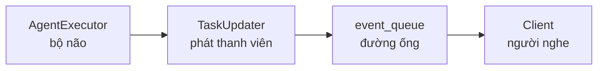
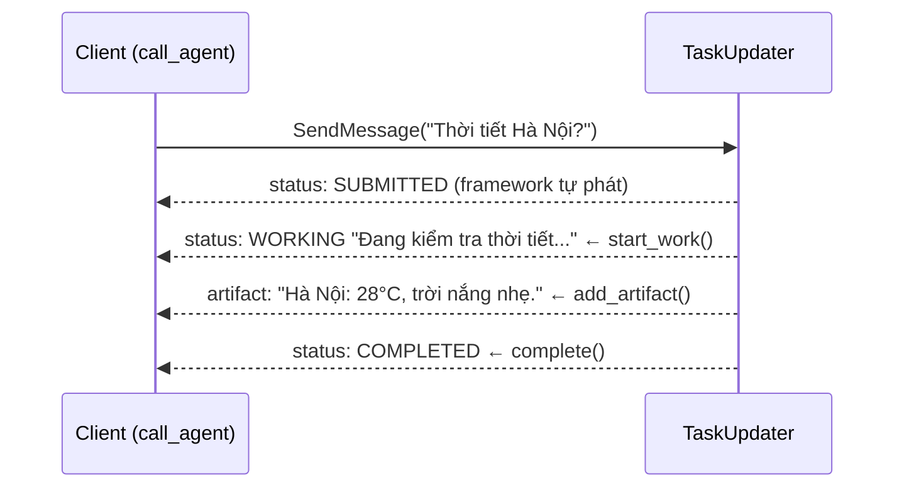

# 📢 `TaskUpdater` — "phát thanh viên" báo trạng thái & kết quả

> File này giải thích **`TaskUpdater` làm gì**, **từng phương thức**, và **client nhìn thấy gì**.
> Mục tiêu: **học sinh cấp 3 cũng hiểu** — ví von đài phát thanh 📻, có timeline, có code thật.

---

## 1. `TaskUpdater` là gì?

**`TaskUpdater` = "Phát thanh viên" của agent.** 🎙️

Khi `AgentExecutor` (bộ não) làm việc, nó cần cho client biết:
- "Tôi đang làm..." → **trạng thái**
- "Đây là kết quả..." → **sản phẩm (artifact)**

Nhưng bộ não **không được phép** tự nói chuyện với client trực tiếp. Nó phải **bơm sự kiện vào `event_queue`** — và `TaskUpdater` là cái loa giúp bơm đúng chuẩn, đẹp đẽ.



> 🎬 **Ví von:** Bộ não là **phóng viên** viết tin. `TaskUpdater` là **phát thanh viên** đọc tin trên sóng. Client là **khán giả** nghe đài. Phóng viên không tự lên sóng được — phải qua phát thanh viên!

---

## 2. "Sóng phát thanh" phát những loại tin gì?

Khi phát thanh viên đọc tin, khán giả nhận được 2 loại bản tin chính:

| Loại tin | Sự kiện trong code | Nội dung |
|---|---|---|
| **Báo trạng thái** | `TaskStatusUpdateEvent` | Task đang ở đâu trong vòng đời + lời nhắn kèm theo |
| **Giao sản phẩm** | `TaskArtifactUpdateEvent` | Kết quả thật sự (artifact) |

Client lắng nghe "sóng" qua `async for event in client.send_message(...)` và kiểm tra loại tin bằng `event.HasField("status_update")` / `event.HasField("artifact_update")` (xem lại giải thích `call_agent()` trong notebook).

---

## 3. Từng phương thức của `TaskUpdater`

`TaskUpdater` là "hộp công cụ" các nút bấm của phát thanh viên:

### Nhóm "đọc trạng thái" (trạng thái)

| Phương thức | Phát trạng thái | Ví von | Khi nào dùng |
|---|---|---|---|
| `await updater.submit()` | `SUBMITTED` | "Đã nhận đơn" | Thường framework lo; ít khi tự gọi |
| `await updater.start_work(msg)` | `WORKING` | "Đang nấu..." | **Khi bắt đầu xử lý** (hay dùng) |
| `await updater.complete(msg)` | `COMPLETED` | "Món đã lên" | **Khi xong** (hay dùng) |
| `await updater.failed(msg)` | `FAILED` | "Nấu hỏng" | Khi có lỗi |
| `await updater.reject(msg)` | `REJECTED` | "Quán từ chối" | Khi không nhận làm |
| `await updater.cancel(msg)` | `CANCELED` | "Khách huỷ" | Khi huỷ (thường trong `cancel()`) |
| `await updater.requires_input(msg)` | `INPUT_REQUIRED` | "Phở hay bún?" | Khi cần hỏi thêm |
| `await updater.requires_auth(msg)` | `AUTH_REQUIRED` | "Cho xem thẻ" | Khi cần xác thực |

> Tất cả các phương thức trên đều "đi qua" một phương thức gốc là `update_status(state, message, ...)` — nút tổng.

### Nhóm "giao sản phẩm"

| Phương thức | Làm gì | Ví von |
|---|---|---|
| `await updater.add_artifact(parts=[...], name=..., last_chunk=True)` | Phát 1 phần (chunk) của kết quả | Bưng ra một phần món ăn |
| `updater.new_agent_message(parts=[...])` | **Tạo** 1 message của agent (chưa phát) | Soạn lời nhắn để kèm vào trạng thái |

### ⭐ `add_artifact` — bí quyết "phát từng phần" (streaming)

```python
await updater.add_artifact(parts=[Part(text="Hà Nội: ")], name="response")          # phần 1
await updater.add_artifact(parts=[Part(text="28°C, nắng nhẹ.")], name="response",   # phần 2
                           append=True, last_chunk=True)
```

- Mỗi lần gọi = phát **một phần** kết quả.
- `name="response"` → gom các phần vào **cùng một artifact**.
- `append=True` → phần này **nối tiếp** phần trước.
- `last_chunk=True` → đây là **phần cuối cùng** — client biết "hết rồi".

> 🎬 **Ví von:** Giống như livestream nấu ăn — đầu bếp bưng món ra **từng thìa**: "cho hành... thêm ớt... xong!". Khán giả thấy món được dần dần thay vì chờ nguyên nồi.

---

## 4. ⚠️ Quy tắc "cửa một chiều" (bắt buộc nhớ!)

`TaskUpdater` có một **cảnh báo cứng**: một khi task đã đạt **trạng thái terminal** (`completed`/`failed`/`canceled`/`rejected`), mọi lần gọi tiếp theo sẽ **ném lỗi**:

```
RuntimeError: Task <id> is already in a terminal state.
```

**Ví dụ LỖI:**

```python
await updater.complete()          # ✅ xong
await updater.add_artifact(...)   # ❌ BÙM! Task đã terminal rồi
```

> 🚪 **Bài học:** Hãy phát **artifact trước, rồi mới `complete()`**. Đừng phát gì sau trạng thái cuối. (Trong code ví dụ của chúng ta: `add_artifact` → `complete` — đúng thứ tự ✅)

---

## 5. Timeline đầy đủ — "client nhìn thấy gì?"

Giả sử bạn chạy cell gọi Weather Agent trong notebook:

```python
await call_agent("http://127.0.0.1:41251", "Thời tiết Hà Nội?")
```

**Bên trong server** phát thanh viên đọc theo trình tự:



**Client in ra màn hình:**

```
      [status] TASK_STATE_SUBMITTED
      [status] TASK_STATE_WORKING Đang kiểm tra thời tiết...
      [status] TASK_STATE_COMPLETED

=== KẾT QUẢ WEATHER ===
Hà Nội: 28°C, trời nắng nhẹ.
```

> 📌 **Chú ý:** Phần `[status]` là do `call_agent(verbose=True)` in ra khi nó nhận sự kiện `status_update`. Phần "KẾT QUẢ" là **artifact** — thứ `call_agent()` gom lại và trả về.

---

## 6. Mã nguồn gốc của `TaskUpdater` (đọc thêm)

Nếu muốn đọc tận gốc, mở `refs/a2a-python/src/a2a/server/tasks/task_updater.py`. Những chi tiết thú vị:

- `_terminal_states = {COMPLETED, CANCELED, FAILED, REJECTED}` — chính là "cửa một chiều".
- `update_status(...)` — nút tổng: tạo `TaskStatus(state, message, timestamp)` rồi bơm `TaskStatusUpdateEvent`.
- `add_artifact(...)` — tạo `Artifact(artifact_id, name, parts, ...)` rồi bơm `TaskArtifactUpdateEvent`; nếu không truyền `artifact_id` thì tự sinh UUID.
- `new_agent_message(...)` — **chỉ tạo** message (role=AGENT), **không tự phát**; bạn phải đưa nó vào `start_work()`/`complete()` để kèm lời nhắn.

---

## 7. Tóm tắt nhanh

| Bạn cần làm | Dùng cái gì |
|---|---|
| Báo "đang làm" | `await updater.start_work(message=updater.new_agent_message(...))` |
| Giao kết quả | `await updater.add_artifact(parts=[Part(text=...)])` |
| Báo "xong" | `await updater.complete()` |
| Báo lỗi | `await updater.failed()` |
| Hỏi thêm | `await updater.requires_input()` |
| Huỷ | `await updater.cancel()` (đặt trong `cancel()`) |
| ⚠️ Tránh | Gọi gì đó **sau** trạng thái terminal |

---

## 8. Tham khảo trong repo

- Toàn bộ `TaskUpdater`: `refs/a2a-python/src/a2a/server/tasks/task_updater.py`
- Các sự kiện (`TaskStatusUpdateEvent`, `TaskArtifactUpdateEvent`): `refs/A2A/specification/a2a.proto`
- Kiến trúc hàng đợi sự kiện: `refs/a2a-python/src/a2a/server/events/event_queue_v2.py`
- Code thật dùng `TaskUpdater`: `my_a2a_system/weather_agent.py`, `orchestrator_agent.py`
